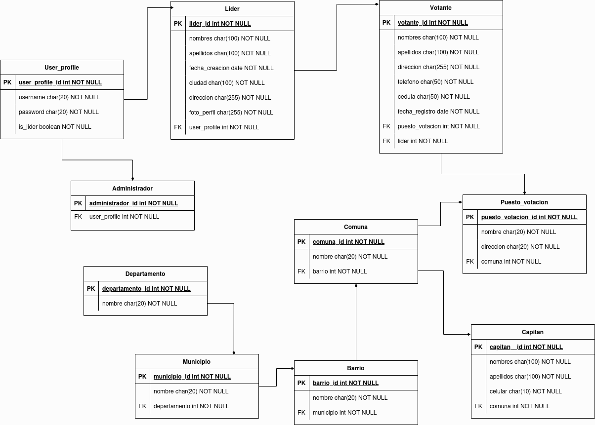

# Documentación de la API

Este proyecto utiliza Django y consta de tres aplicaciones principales:

    usuarios
    localizaciones
    votantes

Estructura del Proyecto

Usuarios
Rutas:

    Administradores:
      /auth/admin/login/: Autenticación de administradores.
      /auth/admin/refresh/: Actualización del token de administrador.
      /auth/admin/registrar/: Registro de administradores.
      
    Lideres:
      /auth/lider/login/: Inicio de sesión de líderes.
      /auth/lider/refresh/: Actualización del token de líderes.
      /auth/lider/registrar/: Registro de líderes.

    Capitanes:
      Listado: /auth/capitan/
      Crear: /auth/capitan/crear/
      Actualizar: /auth/capitan/editar/<int:pk>/
      Eliminar: /auth/capitan/eliminar/<int:pk>/

Localizaciones
Rutas:

    Departamentos:
    
        Listado: /ubicacion/departamentos/
        Detalle: /ubicacion/departamentos/<id>/
        Crear: /ubicacion/departamentos/create/
        Actualizar: /ubicacion/departamentos/update/<id>/
        Eliminar: /ubicacion/departamentos/delete/<id>/
        
    Municipios:
    
        Listado: /ubicacion/municipios/
        Detalle: /ubicacion/municipios/<id>/
        Crear: /ubicacion/municipios/create/
        Actualizar: /ubicacion/municipios/update/<id>/
        Eliminar: /ubicacion/municipios/delete/<id>/
        
    Barrios:
    
        Listado: /ubicacion/barrios/
        Detalle: /ubicacion/barrios/<id>/
        Crear: /ubicacion/barrios/create/
        Actualizar: /ubicacion/barrios/update/<id>/
        Eliminar: /ubicacion/barrios/delete/<id>/
        
    Comunas:
    
        Listado: /ubicacion/comunas/
        Detalle: /ubicacion/comunas/<id>/
        Crear: /ubicacion/comunas/create/
        Actualizar: /ubicacion/comunas/update/<id>/
        Eliminar: /ubicacion/comunas/delete/<id>/
        
    Puestos:
    
        Listado: /ubicacion/puestos/
        Detalle: /ubicacion/puestos/<id>/
        Crear: /ubicacion/puestos/create/
        Actualizar: /ubicacion/puestos/update/<id>/
        Eliminar: /ubicacion/puestos/delete/<id>/

Votantes
Rutas:

    Votantes:
    
        Registrar: /votantes/registrar/
        Listar: /votantes/listar/
        Editar: /votantes/editar/<id>/
        Eliminar: /votantes/eliminar/<id>/
    
    Información sobre Votantes:
    
        Cantidad de Votantes por Líder: /votantes/cantiad_votantes_lider/<lider_id>/
        Cantidad Total de Votantes: /votantes/cantidad_votantes_total/
        Cantidad de Votantes por Municipio: /votantes/cantidad_votantes_municipio/<municipio_id>/
        Cantidad de Votantes por Mesas: /votantes/cantidad_votantes_mesas/<mesa_id>/

Capas de la Solución

    Vistas (Views): Las vistas en cada aplicación manejan las solicitudes HTTP y definen la lógica de negocio para cada ruta.
    Modelos (Models): Los modelos en cada aplicación representan la estructura de datos en la base de datos.
    Serializadores (Serializers): Convierten los modelos a JSON para las respuestas de la API.

Almacenamiento de Datos

Los datos se almacenan en una base de datos Sqlite configurada para este proyecto. Cada aplicación tiene sus propios modelos que definen la estructura de datos.

Ejecución del Proyecto
    
    Clonar este repositorio: 
    git clone https://github.com/SebastianMoralesDuque/prueba_tecnica
    
    Crear un entorno virtual en la carpeta:
    python3 -m venv nombre_del_entorno
    
    Activar el entorno virtual:
    En Windows:
    nombre_del_entorno\Scripts\activate
    En macOS y Linux:
    source nombre_del_entorno/bin/activate

    Instalar los requisitos del proyecto: 
    pip install -r requirements.txt
    
    Realizar migraciones: 
    python manage.py makemigrations
    python manage.py migrate
    
    Ejecutar el servidor: 
    python manage.py runserver

Colecciones de Programas

Las colecciones de programas Insomnia para probar las rutas están disponibles en el repositorio bajo la carpeta insomnia/insomnia_data_api.json.
